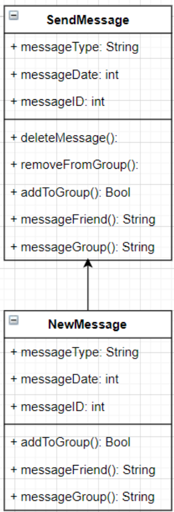

**D5. Design**

1. **Introduction**

The problem of disconnect between students on campus affects students who struggle to meet people with similar interests; the impact of which is many of the students on campus feel disconnected from their peers and in turn will lose opportunities to build connections, this is especially true for freshman and transfer students. For students who feel lonely or want to meet new people with the same hobbies, NCSM is a campus-based social media application that allows students to find events occuring on campus, find clubs that catch their interest, meet students with similar tastes, and navigate campus efficiently and effectively. Student users will be able to utilize a variety of features including: creating a post, adding friends, joining organizations and clubs, receive information from faculty, and add events to their calendar to name a few. Organizations will be able to create posts that provide extra information about their current projects and events. Faculty will be able to edit club pages that they are associated with and create posts that are shared with students that are associated with that class. The school that the different users are linked with will be able to remove any members that are violating the terms of service. Unlike NAUgo, our product will provide an updated way of connecting individuals and the university. NCSM is a campus-based social media application that helps students who feel disconnected from their university and fellow students to meet others with similar interests, connect with clubs, and navigate the way around the university unlike current social media applications.
Github: https://github.com/mdb435/NCSM
Trello:  CS386 Project | Trello

2. **Architecture**

3. **Class Diagram**

4. **Sequence Diagram**

**Use Case:** Direct messaging a friend

**Actor:** College Student

**Description:** The college student can message their friends on the app

**Pre-Conditions:** The college student has an account

**Post-Conditions:** Having the friend see the message and responds back

**Main Flow:**

The college student searches their contact list for a recipient.

The server calls the database and returns the contact.

The user types a message and presses a button to send the message.

The server retrieves the message and sends it to the desired recipient.

**Alternative Flows:**

The college student messaged someone whose profile is private and the message had to be accepted for the other student to see it.

The message doesn't get accepted so the other student does not view it

5. **Design Patterns**
**Design Pattern 1: (Structural) Composite:**
Student has the ability to be faculty, and vice versa. User acts as the primitive action that Student and Faculty can take.

**Design Pattern 2: (Behavioral) Template Method:** 
Overrides the messageFriend(), messageGroup(), and addToGroup() methods, and inherits deleteMessage(), and removeFromGroup() as expected.

**Design Pattern 3: (Behavioral) Strategy:** User can send messages, but can pick to either send a group message or a personal message. The system accounts for the slight differences in these actions.

6. **Design Principles**

**Single Responsibility Principle:** Our club class only deals with club related responsibilities.

**Opened/Closed Principle:** Our system follows this principle in the way that it is closed to editing page layout, but you can still extend the profile by editing and customizing it.

**Liskov Substitution Principle:** Our system follows this principle in that it is compatible with both IOS and android operating systems without having to change clients on different devices.

**Interface Segregation Principle:** Our system follows this principle by having separate interfaces for different schools.

**Dependency Inversion Principle:** Our system follows this principle by having the class “School” not directly interacted with but by interacting with separate instances of schools.
